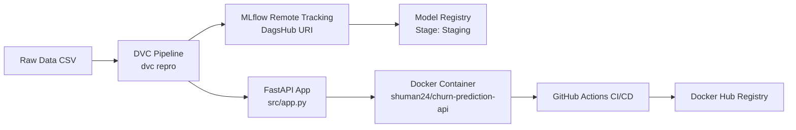

# Employee Churn Prediction — End-to-End MLOps Pipeline

An end-to-end, production-ready MLOps project that predicts employee churn (attrition) using machine learning. This repository demonstrates modern MLOps practices: pipeline orchestration with DVC, experiment tracking & model registry on DagsHub (MLflow), REST API serving with FastAPI, containerization with Docker, and automated testing & deployment using GitHub Actions CI/CD.

---

## Table of Contents
- [Architecture & System Flow](#architecture--system-flow)
- [Tech Stack](#tech-stack)
- [Pipeline Stages (What & Why)](#pipeline-stages-what--why)
  - [1. Data Ingestion](#1-data-ingestion-srcdatadata_ingestionpy)
  - [2. Data Preprocessing](#2-data-preprocessing-srcdatadata_preprocessingpy)
  - [3. Feature Engineering & Scaling](#3-feature-engineering--scaling-srcfeaturesfeature_engineeringpy)
  - [4. Model Training](#4-model-training-srcmodelmodel_buildingpy)
  - [5. Model Evaluation & MLflow Tracking](#5-model-evaluation--mlflow-tracking-srcmodelmodel_evaluationpy)
  - [6. Automated Model Registration](#6-automated-model-registration-srcmodelregister_modelpy)
- [FastAPI Model Serving (src/app.py)](#fastapi-model-serving-srcapppy)
- [Docker Containerization](#docker-containerization)
- [CI/CD Pipeline with GitHub Actions](#cicd-pipeline-with-github-actions)
- [Quick Start: How to Run Locally](#quick-start-how-to-run-locally)
- [Project Directory Structure](#project-directory-structure)

---

## Architecture & System Flow



---

## Tech Stack

| Domain | Tool / Framework | Purpose |
| :--- | :--- | :--- |
| **Pipeline & Versioning** | DVC | Orchestrates pipeline stages and versions data & models |
| **Experiment Tracking** | MLflow + DagsHub | Logs hyperparameters, metrics, and models to remote cloud |
| **Model Registry** | DagsHub Model Registry | Tracks model versions and automates Staging stage transitions |
| **Machine Learning** | Scikit-Learn, Pandas, NumPy | Data processing, feature engineering, and Random Forest classifier |
| **API Serving** | FastAPI, Uvicorn | High-performance REST API for real-time and batch predictions |
| **Testing** | Pytest, HTTPX | Automated API and data pipeline test suite |
| **Containerization** | Docker | Multi-platform container runtime for repeatable deployments |
| **CI/CD Automation** | GitHub Actions | Automated linting, test execution, Docker build, and push |

---

## Pipeline Stages (What & Why)

The entire machine learning lifecycle is divided into reproducible stages defined in `dvc.yaml`:

```
dvc repro
```

### 1. Data Ingestion (`src/data/data_ingestion.py`)
* **What it does:** Reads the raw dataset (`WA_Fn-UseC_-HR-Employee-Attrition.csv`) and splits it into stratified train and test sets based on `data_ingestion.test_size` configured in `params.yaml`.
* **Outputs:** `data/raw/train.csv`, `data/raw/test.csv`.

### 2. Data Preprocessing (`src/data/data_preprocessing.py`)
* **What it does:**
  * Drops zero-variance and identifier columns (`EmployeeCount`, `StandardHours`, `Over18`, `EmployeeNumber`).
  * Encodes the binary target variable `Attrition` (`Yes` -> `1`, `No` -> `0`).
  * Log-transforms highly skewed numerical columns (`skew > 0.75`).
  * Encodes categorical columns using One-Hot Encoding and aligns train/test schemas.
* **Outputs:** `data/interim/train_processed.csv`, `data/interim/test_processed.csv`.

### 3. Feature Engineering & Scaling (`src/features/feature_engineering.py`)
* **What it does:**
  * Creates domain interaction features:
    * `TenurePerAge` = `YearsAtCompany` / `Age`
    * `YearsInRoleRatio` = `YearsInCurrentRole` / `YearsAtCompany`
    * `YearsWithManagerRatio` = `YearsWithCurrManager` / `YearsAtCompany`
    * `IncomePerWorkingYear` = `MonthlyIncome` / `TotalWorkingYears`
    * `PromotionTenureRatio` = `YearsSinceLastPromotion` / `YearsAtCompany`
  * Fits a `StandardScaler` strictly on the training set.
* **Outputs:** `data/processed/train_features.csv`, `data/processed/test_features.csv`, `models/scaler.pkl`.

### 4. Model Training (`src/model/model_building.py`)
* **What it does:** Instantiates and trains a `RandomForestClassifier` using hyperparameter values defined in `params.yaml` (`n_estimators`, `max_depth`, `min_samples_split`, `min_samples_leaf`, `random_state`).
* **Outputs:** `models/model.pkl`.

### 5. Model Evaluation & MLflow Tracking (`src/model/model_evaluation.py`)
* **What it does:**
  * Computes classification metrics: **Accuracy**, **Precision**, **Recall**, **F1-Score**, and **ROC-AUC**.
  * Logs hyperparameters (`mlflow.log_params`) and metrics (`mlflow.log_metrics`) to the remote DagsHub MLflow tracking server.
  * Uploads the serialized model artifact folder to MLflow.
  * Exports `reports/metrics.json` and saves `reports/experiment_info.json` (containing `run_id` for downstream registration).
* **Outputs:** `reports/metrics.json`, `reports/experiment_info.json`.

### 6. Automated Model Registration (`src/model/register_model.py`)
* **What it does:**
  * Reads the `run_id` from `reports/experiment_info.json`.
  * Registers the model in the MLflow Model Registry under the name **`RandomForestChurnModel`**.
  * Automatically transitions the latest registered model version to the **`Staging`** stage and archives older staging versions.

---

## FastAPI Model Serving (`src/app.py`)

A lightweight, robust REST API built to serve predictions with automatic feature transformation and scaling.

### Key Endpoints:
- `GET /` — API health check and status.
- `POST /predict` — Accepts a single JSON object or a batch list of employee records and returns predicted churn classes, labels (`Stay` / `Leave`), and churn probabilities.
- `GET /docs` — Interactive Swagger UI documentation.

#### Sample Request (`POST /predict`):
```json
{
  "Age": 35,
  "BusinessTravel": "Travel_Rarely",
  "DailyRate": 800,
  "Department": "Research & Development",
  "DistanceFromHome": 10,
  "Education": 3,
  "EducationField": "Life Sciences",
  "EnvironmentSatisfaction": 3,
  "Gender": "Male",
  "HourlyRate": 65,
  "JobInvolvement": 3,
  "JobLevel": 2,
  "JobSatisfaction": 4,
  "MaritalStatus": "Single",
  "MonthlyIncome": 5000,
  "MonthlyRate": 19000,
  "NumCompaniesWorked": 2,
  "OverTime": "No",
  "PercentSalaryHike": 15,
  "PerformanceRating": 3,
  "RelationshipSatisfaction": 3,
  "StockOptionLevel": 1,
  "TotalWorkingYears": 10,
  "TrainingTimesLastYear": 2,
  "WorkLifeBalance": 3,
  "YearsAtCompany": 5,
  "YearsInCurrentRole": 3,
  "YearsSinceLastPromotion": 1,
  "YearsWithCurrManager": 3
}
```

#### Sample Response:
```json
{
  "predictions": [0],
  "churn_labels": ["Stay"],
  "probabilities": [0.14]
}
```

---

## Docker Containerization

The application is containerized using a slim Python 3.11 base image.

### Run with Docker:
```powershell
# 1. Pull the image from Docker Hub
docker pull shuman24/churn-prediction-api:latest

# 2. Run container on port 8000
docker run -d -p 8000:8000 --name churn_service shuman24/churn-prediction-api:latest

# 3. Access Swagger Docs
# Open http://localhost:8000/docs in your browser
```

---

## CI/CD Pipeline with GitHub Actions

Located at `.github/workflows/ci_cd.yml`, the pipeline runs automatically on every `git push` to `main`:

1. **Continuous Integration (CI):**
   * Sets up Python 3.11 and installs project dependencies.
   * Verifies model and scaler artifacts can be loaded.
   * Executes automated unit tests using `python -m pytest tests/ -v`.
2. **Continuous Delivery (CD):**
   * Authenticates with Docker Hub using repository secrets (`DOCKER_USERNAME`, `DOCKER_PASSWORD`).
   * Builds the Docker image.
   * Pushes the updated image tagged as `latest` and `<commit-sha>` to Docker Hub.

---

## Quick Start: How to Run Locally

### 1. Clone & Set Up Environment
```powershell
git clone https://github.com/sujat-khan/Churn-Mlops-Pipeline.git
cd Churn-Mlops-Pipeline

# Create and activate virtual environment
python -m venv myvenv
.\myvenv\Scripts\Activate.ps1

# Install dependencies
pip install -r requirements.txt
```

### 2. Configure Environment Variables (`.env`)
Create a `.env` file in the root directory:
```env
MLFLOW_TRACKING_URI=https://dagshub.com/sujat-khan/Churn-Mlops-Pipeline.mlflow
repo_owner=sujat-khan
repo_name=Churn-Mlops-Pipeline
DAGSHUB_PAT=<your-dagshub-access-token>
```

### 3. Pull Data and Models from DVC Remote
```powershell
dvc pull
```

### 4. Run or Reproduce the Pipeline
```powershell
dvc repro
```

### 5. Run Tests
```powershell
pytest -v
```

### 6. Start the API Server Locally
```powershell
uvicorn src.app:app --reload --port 8000
```
Open [http://127.0.0.1:8000/docs](http://127.0.0.1:8000/docs) to test predictions.

---

## Project Directory Structure

```
Churn-mlops-pipeline/
├── .dvc/                        # DVC internal configuration
├── .github/
│   └── workflows/
│       └── ci_cd.yml            # GitHub Actions CI/CD configuration
├── data/
│   ├── raw/                     # Raw and train/test split datasets
│   ├── interim/                 # Cleaned and encoded intermediate data
│   └── processed/               # Scaled feature datasets for training
├── models/
│   ├── model.pkl                # Trained RandomForest model artifact
│   └── scaler.pkl               # Fitted StandardScaler artifact
├── reports/
│   ├── metrics.json             # Evaluation metrics output
│   └── experiment_info.json     # Active MLflow run_id and artifact path
├── src/
│   ├── __init__.py
│   ├── app.py                   # FastAPI application & prediction logic
│   ├── data/
│   │   ├── data_ingestion.py    # Raw data loading & stratified split
│   │   └── data_preprocessing.py# Cleaning, log transforms, & encoding
│   ├── features/
│   │   └── feature_engineering.py# Domain ratios & feature standardization
│   └── model/
│       ├── model_building.py    # Model training & serialization
│       ├── model_evaluation.py  # Metrics calculation & MLflow tracking
│       └── register_model.py    # MLflow Model Registry stage promoter
├── tests/
│   └── test_api.py              # Automated Pytest suite for FastAPI
├── .dockerignore
├── .gitignore
├── Dockerfile                   # Docker build definition
├── dvc.lock                     # DVC pipeline state lockfile
├── dvc.yaml                     # DVC multi-stage pipeline definition
├── params.yaml                  # Centralized pipeline hyperparameters
├── requirements.txt             # Project dependencies
└── README.md                    # Project documentation
```
